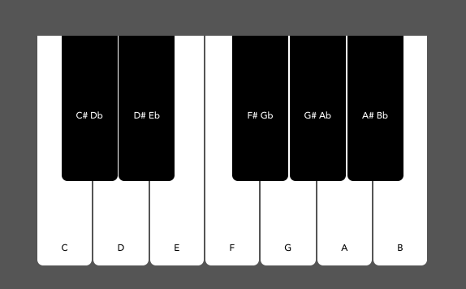
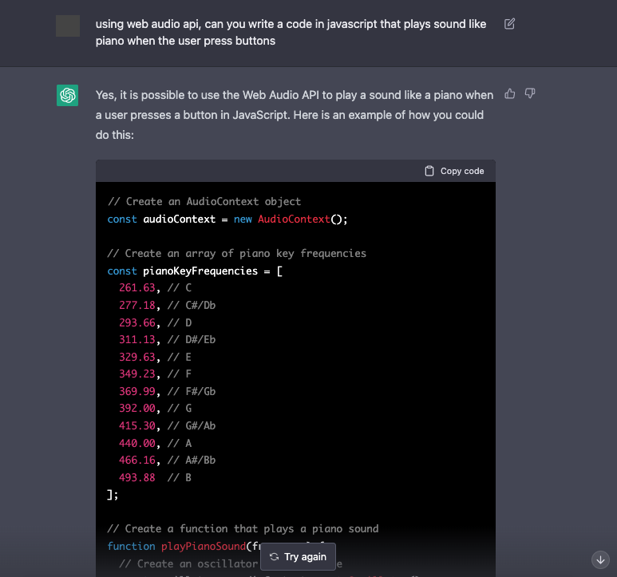
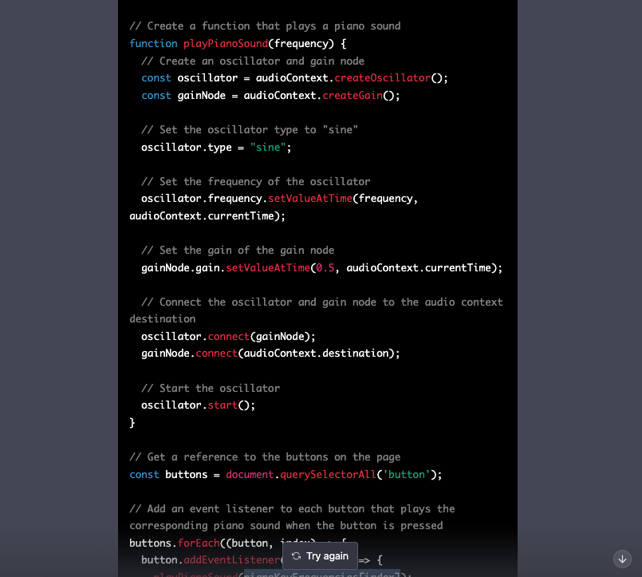
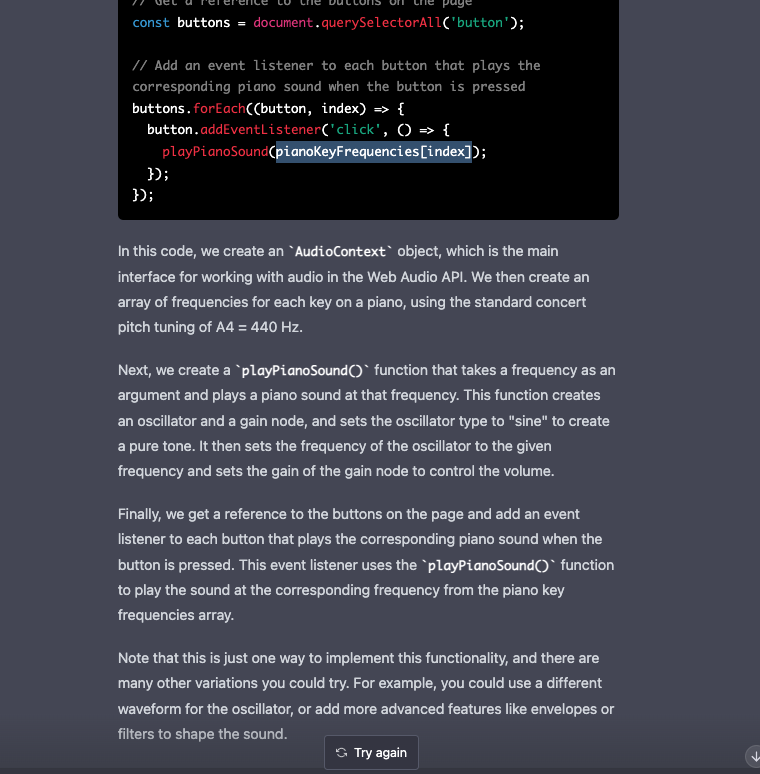

react-piano-openai
==============

This is a piano application using [Web Audio API](https://developer.mozilla.org/en-US/docs/Web/API/Web_Audio_API) built in React with the help of [OpenAI ChatGPT](https://openai.com/blog/chatgpt/).

# Application UI



# Motivation

I am trying to test how an AI, in this case `OpenAI ChatGPT`, could help a developer create something.

Here are the screenshots of the conversation:







I adapted the given code from vanilla JS to be used in React and with minor changes this is what I ended up making. And it works! :)

It is very amazing how far AI technology have come.
Rather than seeing it as a threat, I think AI can complement the work of developers.
The immediate effect, I think, is that this could replace, to a certain degree, using forums. Often times, specially the beginners, they face snarky replies when asking questions in such sites. Using AI would definitely be an improvement.

However, I think, to fully utilize such an AI, the developer needs to write good prompts. They should know when the reply will work or not since there is no guarantee that the given code will actually run.

# Getting Started

Clone the repository, install the dependencies and run

```sh
$ git clone https://github.com/supershaneski/react-piano-openai.git myproject

$ cd myproject

$ npm install

$ npm start
```

Open your browser to `http://localhost:5173/` or some other port depending on the availability.

# Deployment

To deploy in github pages, first install `gh-pages`

```sh
$ npm install gh-pages --save-dev
```

Add `homepage` property in `package.json` with this format `https://{username}:github.io/{project-name}

```javascript
"homepage": "https://supershaneski.github.io/react-piano-openai",
```

Add the following scripts

```javascript
"scripts": {
    "predeploy": "npm run build",
    "deploy": "gh-pages -d build",
```

Edit `vite.config.js`

```javascript
export default defineConfig({
  base: "/react-piano-openai/",
  plugins: [react()],
  build: {
    outDir: "build",
```

Push the app to the `GitHub` repository

```sh
$ npm run deploy -- -m "deploy react app to github pages"
```

## Configure GitHub Pages

See reference [page](https://github.com/gitname/react-gh-pages)